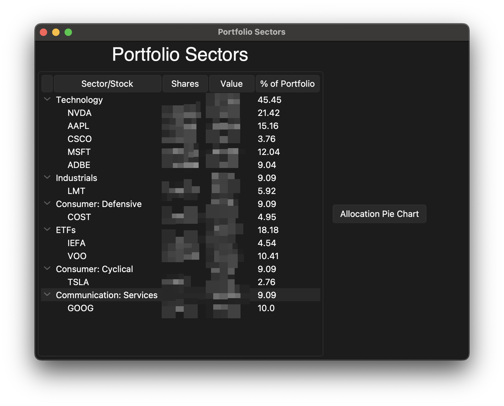
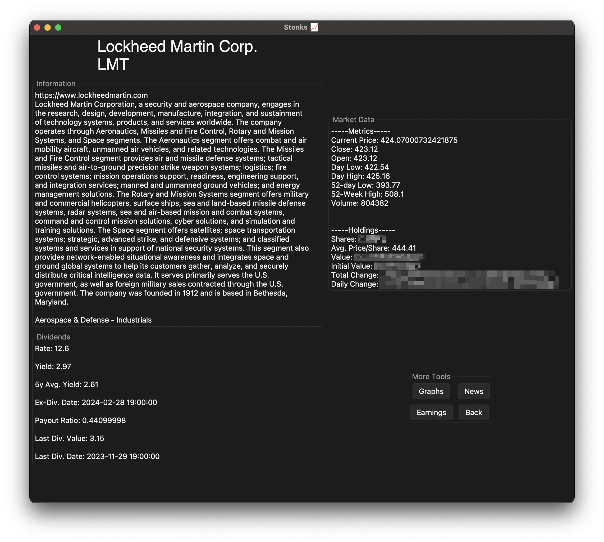

# Portfolio Tracker
## View important portfolio information and visualize data to stay informed and make educated decisions

# Quick Start
1. Install dependencies:
   * Python 3
     * `pip3 install pandas`
     * `pip3 install yfinance`
     * `pip3 install sv-ttk`
     * `pip3 install matplotlib`
     * `pip3 install nltk`
     * `pip3 install scikit-learn`
     * Script will try to install these if one isn't found
2. Download [PortfolioTracker.pyw](https://github.com/teekar2023/StockTracker/blob/master/PortfolioTracker.pyw) to any folder
3.  Navigate to folder and run `python PortfolioTracker.pyw`
4. Configure your portfolio with the buttons

# Features
## Homepage
### Holdings information display, quick access to everything the app has to offer

## Assistant
### Get quick answers about your portfolio data

---
## Summary
### Allocation information, gain/loss insights, and more coming

---
## Benchmark
### Compare your portfolio to an index to evaluate how it's performing

---
## Dividends
### Dividend yields, forecasts, and recently received dividends

---
## Data
### Basic information, market data, holdings, and more

---
## Options
### Customization, price alerts, and other settings

