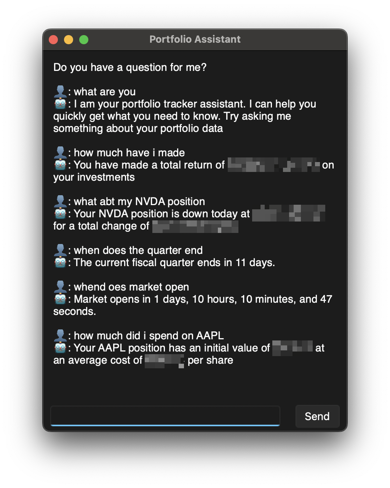

# Portfolio Tracker
## View important portfolio information and visualize data to stay informed and make educated decisions

# Quick Start
1. Install dependencies:
   * Python 3
     * Run these commands in terminal
     * `pip install pandas`
     * `pip install yfinance`
     * `pip install sv-ttk`
     * `pip install matplotlib`
2. Download [PortfolioTracker.pyw](https://github.com/teekar2023/StockTracker/blob/master/PortfolioTracker.pyw) to any folder
3.  Navigate to folder and run `python PortfolioTracker.pyw`
4. Configure your portfolio with the buttons

# Features
## Assistant
### Get quick answers about your portfolio data

## Summary
### Allocation information, gain/loss insights, and more coming

---
## Dividends
### Dividend yields, forecasts, and recently received dividends

---
## Ticker Data
### Basic information, market data, holdings, and more

---
## Options
### Customization, price alerts, and other settings

# TODO
* Stock specific graphs, news, and earnings information
* Portfolio benchmark tool
* Portfolio graphs in main window and summary window
* ETF allocation analysis
* Add ai assistant